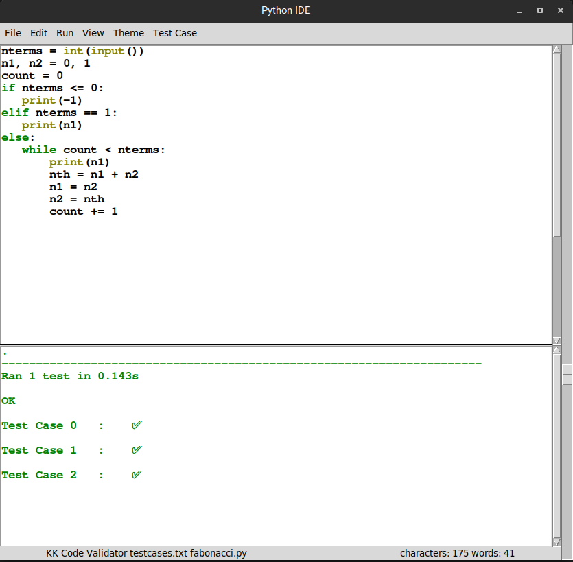
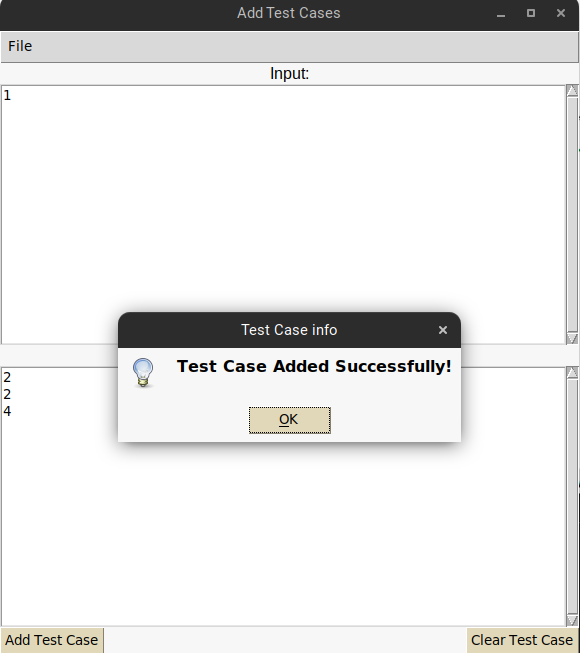

# Code-Validator

-   Code Validator validates code written against given test cases.
-   GUI made with tkinter
-   Open, Save, Save as, Theme, etc options for Python Editor
-   Testing of test cases done using unittest module

    

-   You can manually add test cases using testcasemaker.py

    

# Installation :🚀️

1. Clone Respository

    ```makefile
    $ git clone https://github.com/KunalC-1/Code-Validator.git
    ```

2. Install Tkinter

    ```makefile
    $ sudo apt install python3-tk
    ```

2. Install idlelib

    ```makefile
    $ sudo apt install idle3
    ```

# Run :

-   To add Test Cases

    ```makefile
    $ python3 testcasemaker.py
    ```

-   Run code validator

    ```makefile
    $ python3 gui.py
    ```

# Contributors:

**111903038 : Kalpesh Ahire**

**111903044 : Kunal Chaudhari**
